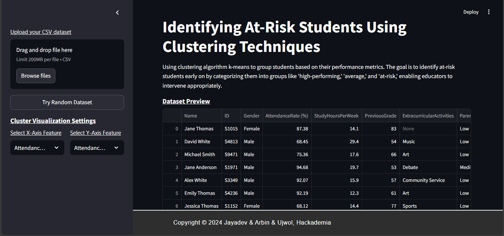
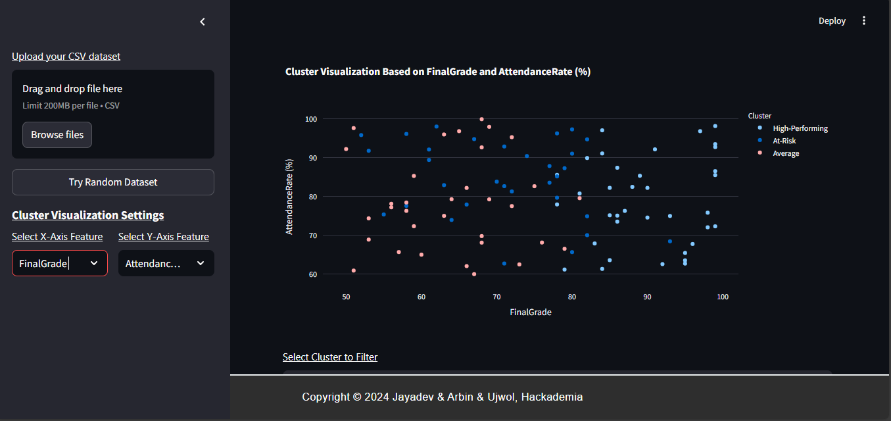
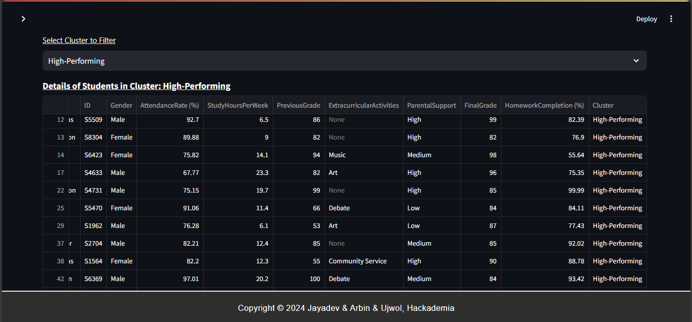

# Identifying At-Risk Students Using Clustering Techniques

## Group Name
At-Risk Student CLustering

## Project Title
Identifying At-Risk Students Using Clustering Techniques

## Group Members
- Jayadev Tripathi
- Arbin Shrestha
- Ujwal Raj Bhattarai

## Project Description

### Project Idea and Approach
This project explores how clustering algorithms, specifically k-means, can be used to group students based on their performance metrics. The aim is to identify at-risk students by categorizing them into groups such as "high-performing," "average," and "at-risk." This classification helps educators to provide timely interventions and support where needed. The project uses a dataset with various student performance metrics and builds a model to perform clustering. An interactive dashboard is included to visualize these clusters and their correlations.

### Tech Stack Used
- **Python**: Programming language used for the implementation.
- **Streamlit**: Framework used to develop the interactive web interface for data visualization.
- **scikit-learn**: Library used for implementing the k-means clustering algorithm.
- **pickle**: Used for saving and loading the clustering model.
- **Pandas**: For data manipulation and handling.
- **NumPy**: For numerical operations.
- **Plotly**: For interactive data visualizations.

## Installation Instructions

1. **Create Virtual Environment**
```
  python -m venv 'env'
  ```

2. **Activate Virtual Environment**
  ```
  venv\Scripts\activate
  ```

3. **Install Dependencies**
  ```
  pip install -r requirements.txt
  ```

After setting up the environment and installing the dependencies, you can run the project as described in the project documentation.

## Running the Project
To run the project, you can use the following command:

```
streamlit run interface.py
```
## Screenshot:


